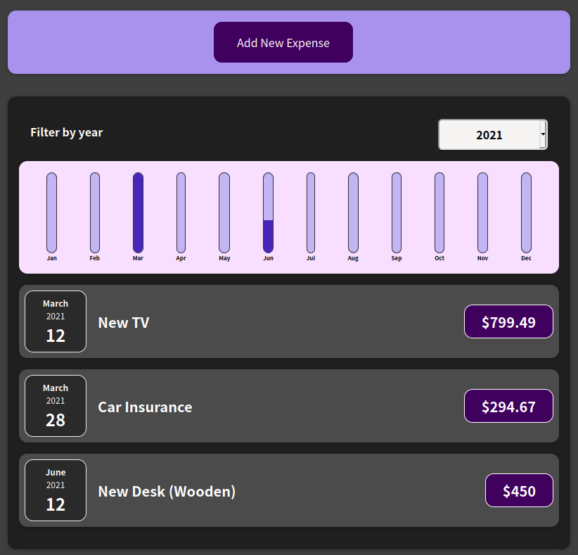

<h1 align="center">
  
</h1>

<h4 align="center">
  Projects done in Udemy courses.
</h4>

 
 

## [Maximilian Schwarzmüller](https://www.udemy.com/user/maximilian-schwarzmuller/)

### [Understanding TypeScript - 2020 Edition](https://www.udemy.com/course/understanding-typescript/)

- [Drag'n'drop](https://github.com/pablomaribondo/dragndrop)

  <kbd>
    
  </kbd>

### [React - The Complete Guide (incl Hooks, React Router, Redux)](https://www.udemy.com/course/react-the-complete-guide-incl-redux/)

- [food-order-app](https://github.com/pablomaribondo/food-order-app)

  <kbd>
    
  </kbd>

- [expense-tracker](https://github.com/pablomaribondo/expense-tracker)

  <kbd>
    
  </kbd>

### [React Native - The Practical Guide [2022]](https://www.udemy.com/course/react-native-the-practical-guide/)

- [guess-a-number-app](https://github.com/pablomaribondo/guess-a-number-app) - IN PROGRESS
- [task-app](https://github.com/pablomaribondo/task-app) - IN PROGRESS

 
 

## [Rodrigo Manguinho](https://www.udemy.com/user/rodrigo-manguinho/)

### [ReactJS, Hooks, Recoil, TDD, Clean Architecture, SOLID](https://www.udemy.com/course/react-com-mango/)

- [clean-react](https://github.com/pablomaribondo/clean-react) - IN PROGRESS

### [NodeJs, Typescript, TDD, DDD, Clean Architecture e SOLID](https://www.udemy.com/course/tdd-com-mango/)

- [clean-node-api](https://github.com/pablomaribondo/clean-node-api) - IN PROGRESS
